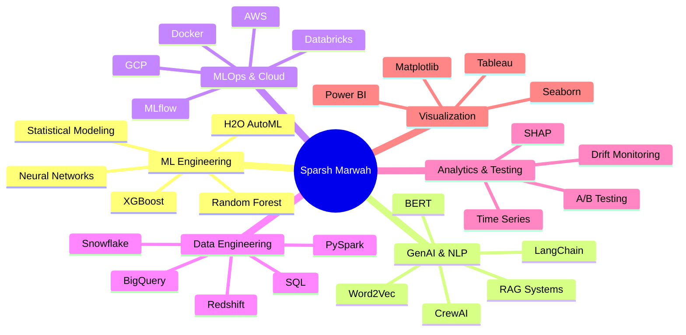
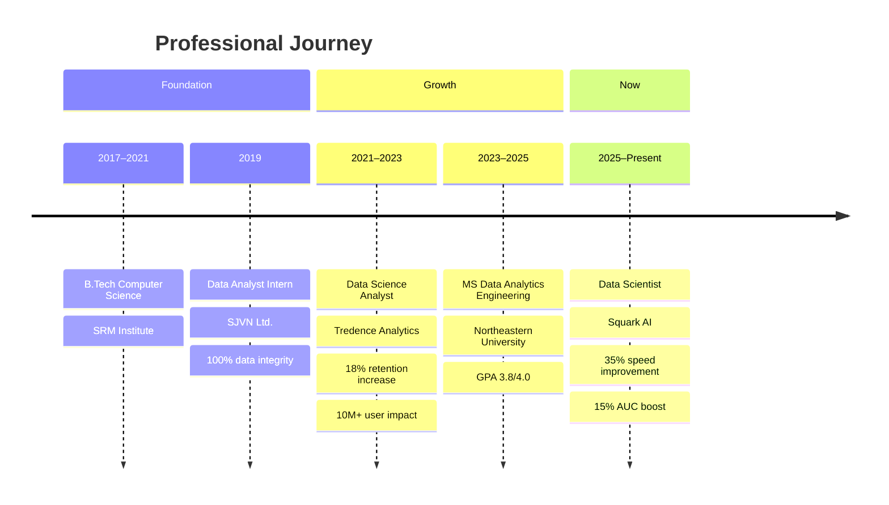

---

## 🚀 About Me

I'm a **Data Scientist** with 3+ years of hands-on experience building end-to-end ML pipelines, GenAI solutions, and enterprise-scale analytics systems. Currently at **Squark AI**, I design cloud-native ML infrastructure using H2O AutoML, NLP embeddings, and production MLOps tooling.

I hold an **MS in Data Analytics Engineering** from **Northeastern University (GPA: 3.8/4.0)** and love turning complex data into measurable real-world impact — from boosting user retention to accelerating model deployment cycles.

---

## 📊 Impact at a Glance

| Metric | Achievement |
|:-------|:------------|
| 🚀 **Model Training Speed** | +35% faster via AWS cloud-native pipeline (H2O AutoML) |
| 📈 **User Retention** | +18% for a 10M+ user retail platform |
| ⚡ **Deployment Time** | −40% through end-to-end MLOps automation in Databricks |
| 💡 **Predictive Accuracy** | +12% with BERT & Word2Vec custom preprocessing |
| 🎯 **AUC Score** | +15% via clustering integration + A/B testing |
| 📊 **Data Integrity** | 100% accuracy during enterprise inventory migration |

---

## 🛠️ Tech Stack

### Languages & Data Engineering

### Machine Learning & AI

### GenAI & LLM Tools

### MLOps & Cloud

### Data Platforms & Warehousing

### Visualization & Analytics

---

## 🧠 Skills Map

---

## 🚀 Featured Projects

### 🤖 AI-Powered Resume & Job Description Matching Assistant

Architected an **Agentic RAG system** using **CrewAI** and **LangChain** to automate context-aware resume scoring and tailored cover letter generation — eliminating manual screening overhead.

`CrewAI` `LangChain` `Agentic AI` `RAG` `GenAI`

---

### 📉 Customer Churn Prediction

Built an **85% accurate predictive model** using **XGBoost** to identify high-risk customer segments and key churn drivers through statistical analysis and feature engineering.

`XGBoost` `Feature Engineering` `Statistical Analysis` `scikit-learn`

---

### 💬 Yelp Sentiment Analyzer & Recommendation System

Developed a **Neural Network with 91.4% accuracy** to classify unstructured Yelp reviews and engineered a **hybrid recommendation engine** using sentiment embeddings for personalized suggestions.

`Neural Networks` `NLP` `Sentiment Analysis` `Recommendation Systems`

---

## 💼 Experience

### 🏢 Data Scientist — Squark AI *(Jun 2025 – Present)*
> Remote, United States

- Built AWS cloud-native ML pipeline using **H2O AutoML** → **35% faster model training**
- Engineered custom preprocessing with **BERT & Word2Vec** embeddings → **+12% predictive accuracy**
- Integrated **MinIO & S3** for artifact versioning → **25% lower data retrieval latency**
- Combined clustering + A/B testing to validate prediction granularity → **+15% AUC score**

---

### 🏢 Data Science Analyst — Tredence Analytics Solutions *(Jun 2021 – Jul 2023)*
> Bengaluru, India

- Built churn models (**Random Forest, XGBoost**) for 10M+ user retail platform → **+18% user retention**
- Engineered end-to-end **MLOps pipelines in Databricks** with automated validation → **−40% deployment time**
- Designed **A/B & multivariate tests** using t-tests → **15% cross-category performance lift**
- Built real-time inference pipelines with automated drift monitoring → **+20% KPI accuracy**

---

### 🏢 Data Analyst Intern — SJVN Ltd. *(Jun 2019 – Dec 2019)*
> Shimla, India

- Developed **SQL validation queries** during inventory migrations → **100% data integrity**
- Built **scikit-learn ML models** in Python → **+20% forecasting accuracy**, reduced stockouts
- Created interactive **Tableau dashboards** → enabled **20+ data-driven decisions weekly**

---

## 🎓 Education

| Degree | Institution | Period | Achievement |
|:-------|:------------|:-------|:------------|
| **MS Data Analytics Engineering** | Northeastern University, Boston MA | Sep 2023 – May 2025 | **GPA: 3.8 / 4.0** |
| **B.Tech Computer Science & Engineering** | SRM Institute of Science & Technology | Jul 2017 – May 2021 | Strong CS Foundation |

*Relevant Coursework: Data Management in Analytics · Data Mining in Engineering · Machine Learning Operations*

---

## 📅 Career Timeline

---

## 📈 GitHub Analytics

---

*Open to Data Science, ML Engineering, and GenAI roles — let's connect!*

