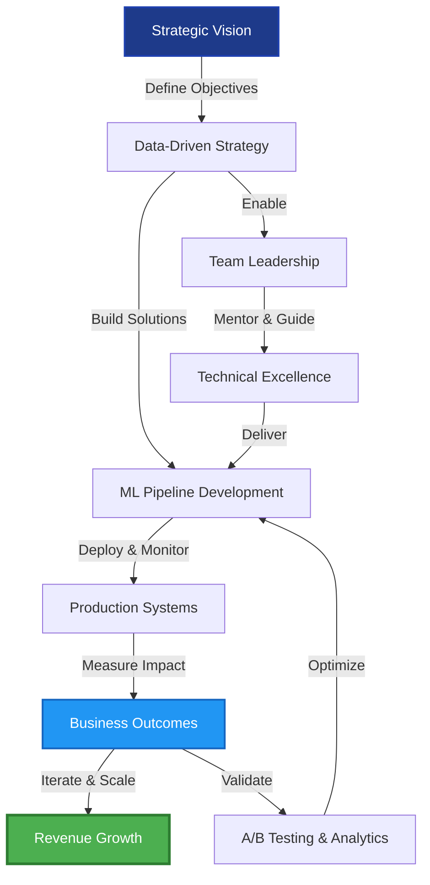
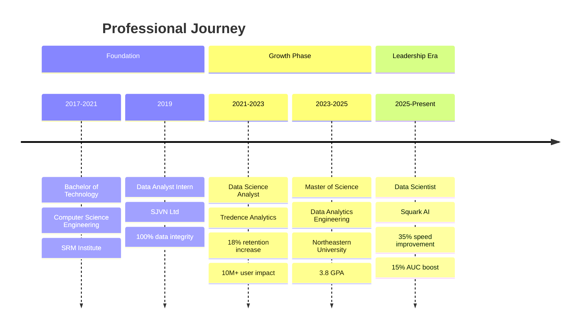
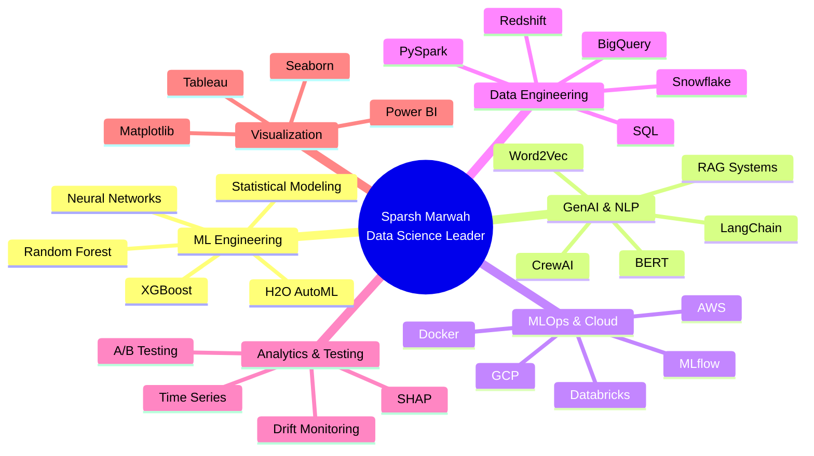
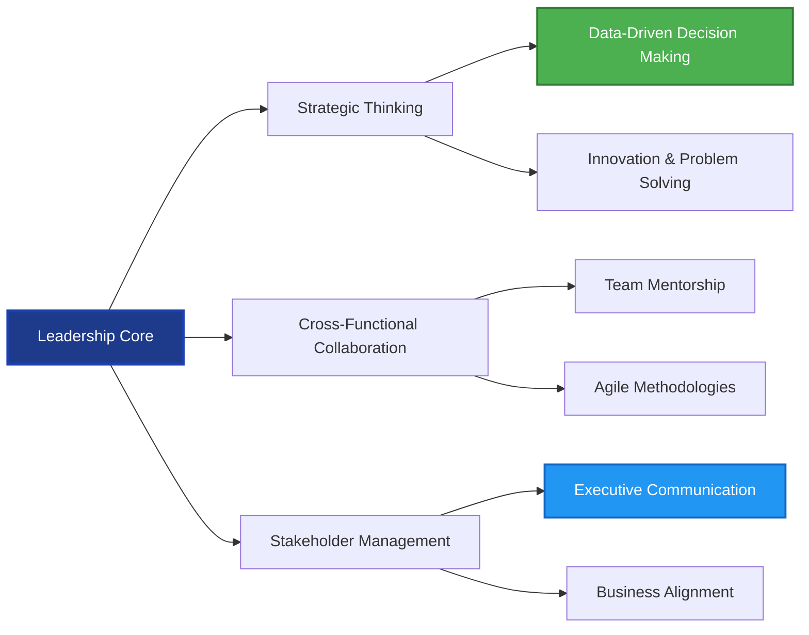

---

## 🎯 Executive Summary

**Data Science Leader** with proven track record of driving **measurable business impact** through advanced ML pipelines, GenAI solutions, and enterprise-scale analytics systems. Specialized in transforming complex data challenges into strategic advantages that directly influence revenue growth and operational efficiency.

### 📊 Leadership Impact Dashboard

| **Metric** | **Achievement** | **Business Value** |
|:-----------|:----------------|:-------------------|
| 🚀 **Model Performance** | 35% faster training speeds | Accelerated time-to-market for ML products |
| 📈 **Predictive Accuracy** | 18% user retention increase | Direct revenue impact for 10M+ user base |
| ⚡ **Operational Efficiency** | 40% reduced deployment time | Streamlined ML development lifecycle |
| 💰 **Cost Optimization** | 25% latency reduction | Enhanced production reliability & cost savings |
| 🎯 **Strategic Initiatives** | 15% AUC improvement | Validated predictive granularity via A/B testing |
| 📊 **Data Integrity** | 100% migration accuracy | Zero tracking errors in enterprise systems |

---

## 💼 Leadership Philosophy

> **"Transforming data complexity into strategic clarity—where every model deployment drives measurable business outcomes, every pipeline optimization accelerates innovation, and every insight empowers stakeholders to make confident, data-driven decisions."**

I lead with a **results-first, people-centric approach**, focusing on building scalable ML systems that deliver tangible ROI while fostering collaborative environments where technical excellence meets business strategy. My leadership emphasizes **cross-functional alignment**, **continuous innovation**, and **sustainable growth**.

---

## 🏗️ Strategic Impact Framework

---

## 📈 Career Progression Timeline

---

## 🎖️ Key Strategic Achievements

### 💡 **ML Infrastructure & Innovation**

**Squark AI** | *Data Scientist* | *Jun 2025 - Present*

- 🚀 **Accelerated Model Training by 35%** — Architected AWS cloud-native ML pipeline using H2O AutoML, supporting diverse structured and unstructured datasets, reducing time-to-market for predictive models
- 📊 **Boosted Predictive Accuracy by 12%** — Engineered custom preprocessing framework with NLP embeddings (BERT, Word2Vec), enhancing feature selection and model precision
- ⚡ **Reduced Data Retrieval Latency by 25%** — Integrated MinIO and S3 for artifact versioning, ensuring production reliability and cost optimization
- 🎯 **Improved AUC Score by 15%** — Led clustering integration initiative, validating redefined prediction granularity through rigorous A/B testing methodology

**Business Impact:** Delivered scalable ML infrastructure that directly improved product performance metrics while reducing operational costs and deployment friction.

---

### 📊 **Enterprise-Scale Analytics & MLOps**

**Tredence Analytics Solutions** | *Data Science Analyst* | *Jun 2021 - Jul 2023*

- 💰 **Increased User Retention by 18%** — Developed and validated predictive churn models (Random Forest, XGBoost) for top-tier retail client with 10M+ user base, driving significant revenue retention
- 🔄 **Reduced Deployment Time by 40%** — Engineered end-to-end MLOps pipelines in Databricks with automated validation checks, accelerating model-to-market cycles
- 📈 **Engineered 15% Performance Lift** — Designed and executed A/B and multivariate tests using statistical rigor (t-tests), improving cross-category product performance
- 🎯 **Enhanced KPI Accuracy by 20%** — Built real-time inference pipelines with automated drift monitoring and retraining, sustaining model performance in production

**Business Impact:** Transformed data science operations from ad-hoc experimentation to systematic, production-ready ML systems that delivered measurable ROI and competitive advantages.

---

### 🔧 **Data Engineering & Analytics Foundation**

**SJVN Ltd.** | *Data Analyst Intern* | *Jun 2019 - Dec 2019*

- ✅ **Ensured 100% Data Integrity** — Developed SQL validation queries during inventory migrations, preventing critical tracking errors
- 📊 **Improved Forecasting Accuracy by 20%** — Built scikit-learn ML models in Python, reducing inventory stockouts and optimizing supply chain
- 📈 **Enabled 20+ Data-Driven Decisions Weekly** — Created interactive Tableau dashboards, improving planning transparency for stakeholders

**Business Impact:** Established robust data quality standards and analytics frameworks that enabled informed decision-making across operations.

---

## 🧠 Technical Leadership Expertise

---

## 🛠️ Technology Stack - Executive Overview

### **Core Programming & Data Science**

### **Machine Learning & AI Frameworks**

### **GenAI & LLM Tools**

### **Cloud & MLOps Infrastructure**

### **Data Platforms & Warehousing**

### **Analytics & Visualization**

---

## 🚀 Featured Strategic Projects

### 🤖 **AI-Powered Resume & Job Description Matching Assistant**

**Strategic Innovation:** Architected Agentic RAG system using CrewAI and LangChain to automate context-aware resume scoring and tailored cover letter generation.

**Technologies:** CrewAI, LangChain, RAG, GenAI  
**Business Value:** Streamlined recruitment workflows, reducing time-to-hire while improving candidate-job alignment accuracy

---

### 📉 **Customer Churn Prediction System**

**Strategic Impact:** Built 85% accurate predictive model using XGBoost to identify high-risk customer segments and key retention drivers.

**Technologies:** XGBoost, Statistical Analysis, Feature Engineering  
**Business Value:** Enabled proactive retention strategies, directly impacting customer lifetime value and revenue stability

---

### 💬 **Yelp Sentiment Analyzer & Recommendation System**

**Strategic Innovation:** Developed Neural Network with 91.4% accuracy to classify unstructured Yelp reviews and engineered hybrid recommendation engine.

**Technologies:** Neural Networks, Sentiment Embeddings, NLP  
**Business Value:** Enhanced user experience through personalized recommendations, driving engagement and platform stickiness

---

## 📚 Education & Continuous Learning

| 🎓 **Degree** | 🏛️ **Institution** | 📅 **Period** | 📊 **Achievement** |
|:-------------|:-------------------|:--------------|:-------------------|
| **Master of Science** Data Analytics Engineering | Northeastern University | Sep 2023 - May 2025 | **GPA: 3.8/4.0** |
| **Bachelor of Technology** Computer Science & Engineering | SRM Institute of Science & Technology | Jul 2017 - May 2021 | **Strong Foundation** |

---

## 🌟 Leadership Competencies & Soft Skills

### **Core Competencies:**
- 🎯 **Strategic Planning:** Translating business objectives into actionable ML roadmaps
- 🤝 **Cross-Functional Leadership:** Bridging technical teams with business stakeholders
- 📊 **Data Storytelling:** Communicating complex insights to executive audiences
- 🔄 **Agile Execution:** Iterative development with continuous feedback loops
- 💡 **Innovation Management:** Identifying emerging technologies for competitive advantage
- 🎓 **Knowledge Sharing:** Building documentation and best practices for team scalability

---

## 📊 GitHub Analytics & Impact

![GitHub Stats](https://github-readme-stats.vercel.app/api?username=sparshmarwah&show_icons=true&theme=tokyonight&hide_border=true&